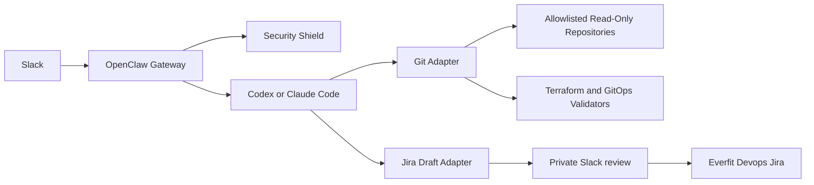

# Friday

## Overview

Friday is a local-first DevOps AI agent for read-only infrastructure pull
request review and requester-approved Jira ticket drafting in Slack. It runs on
OpenClaw, uses Codex or Claude Code for model turns, and reviews only explicitly
allowlisted local repositories.

Friday never receives generic shell, filesystem-write, GitHub-write, deploy, or
cluster-mutation capabilities. It is designed to be operated by one owner in
specific Slack channels.

## Features

- Slack Socket Mode with one or more independently bound Slack Apps, per-turn
  owner authorization, and silent denial.
- One deterministic full-review flow for Terraform, Helm, YAML, JSON,
  Kubernetes, Kustomize, and Datadog Service Catalog changes.
- Jira ticket drafting for the Everfit Devops `ED` project: a Friday-tagged
  thread becomes an English, requester-only draft. The requester can edit its
  title, Task/Bug/Story type, description, priority, existing Epic, and numeric
  Story point estimate before selecting **Approve & Create**.
- Jira creation happens only after approval. Before then, all drafts, errors,
  and workflow feedback are private; after creation the source thread receives
  only the Jira URL.
- Bounded Git/GitHub reads, redacted evidence, local TFLint, Trivy, Helm,
  Kustomize, and kubeconform validation.
- Codex OAuth or Claude Code model backends, with configured fallbacks.
- Reproducible Slack compatibility patches, health probes, backup, and rollback.
- Docker Compose deployment with a non-root image, Docker secrets, read-only
  repository mounts, and persistent state volumes.

## Technology Stack

- Node.js 24 and npm workspaces
- OpenClaw `2026.7.1-2`
- Docker Compose v2
- TypeScript, Node test runner, and tsup
- Slack Socket Mode and GitHub CLI OAuth
- TFLint, Trivy, Helm, Kustomize, and kubeconform

## Security Model

Security Shield verifies the configured Slack account, workspace, channel, and
user for every turn before model inference. Git Adapter accepts only allowlisted
PR URLs and performs bounded read-only operations. Repository output is capped
and redacted; secrets, runtime configuration, databases, credentials, backups,
and local paths never belong in Git.

See [Security Shield](docs/security-persona-shield-v1.md) and
[Architecture](docs/ARCHITECTURE.md) for the complete boundary model.

## Architecture



The source is a four-workspace npm monorepo. `@friday/shared` provides host
neutral contracts; Security Shield, Git Adapter, and Jira Adapter are OpenClaw
plugins; Slack Recovery is an optional macOS watchdog. See the
[Jira Adapter guide](integrations/jira-adapter/README.md) for its exact
workflow and configuration boundary.

## Container Deployment

The container path is the recommended portable deployment. It keeps Friday's
state in a named Docker volume and mounts reviewed repositories read-only.

### 1. Prepare the source and repositories

```bash
git clone <your-Friday-repository-url> friday
cd friday
npm ci
```

Clone each repository Friday may review under one host directory. Configure that
directory in `FRIDAY_REPOSITORIES_DIR`; Compose mounts it at `/repos:ro`.

### 2. Create local runtime files

```bash
npm run container:init
```

Edit `container/.env` and `config/instance.container.json`. Replace every
placeholder, set each repository root to `/repos/<folder>`, and select either
the `codex` or `claude-code` backend. Do not put token values in JSON.

For Jira drafting, put the Jira account email in `container/.env` under the
name configured by `jira.emailEnv` (the example uses `FRIDAY_JIRA_EMAIL`), and
put the API-token value only in `container/secrets/jira-api-token`. The example
Jira block also requires stable IDs for the ED project, assignee, Task/Bug/Story
types, priority, and numeric Story point custom field. These local files are
ignored by Git.

Keep the gateway token in its local secret file, then add one bot/app token pair
for every `slack.accounts[]` record. For an account with `accountId` `infra`, use:

```text
container/secrets/gateway-token
container/secrets/slack-infra-bot-token
container/secrets/slack-infra-app-token
```

The account ID is part of the filename exactly as configured. These files are
ignored by Git and must remain local. The container renders an ignored Compose
override at runtime; token values never enter JSON, Compose source, or the image.

To add a second workspace, create a separate Slack App there, append another
account/workspace/channel/owner binding to `slack.accounts[]`, and write that
App's two token values to its account-specific files. Use `channelId: "*"` when
the configured owner may invoke that App from any channel where it is invited;
the workspace, account, and owner remain exact. Both Apps are served by the
same Friday container; the native gateway is unaffected.

### 3. Build and validate without changing runtime state

```bash
npm run container:setup -- --backend codex
```

Use `--backend claude-code` for Claude Code. This build and dry-run validates
the image, configuration, repositories, binaries, and OpenClaw patch without
logging in, applying configuration, or starting a gateway.

### 4. Authenticate and deploy

```bash
npm run container:setup -- --backend codex --login --apply
```

The interactive flow authenticates GitHub and the selected model backend. For
headless Codex OAuth, open the printed URL on your local browser and paste the
complete redirect URL back into the terminal when prompted.

### 5. Verify Slack and service health

```bash
npm run container:health
```

The gateway binds to `127.0.0.1:18789` by default. Confirm an authorized owner
mention in the configured Slack channel and confirm that an unauthorized mention
is silently denied. Use the complete [Acceptance Checklist](docs/ACCEPTANCE.md).

### 6. Back up or roll back

```bash
npm run container:backup
npm run container:rollback -- friday-home-YYYYMMDDTHHMMSSZ.tgz
npm run container:rollback -- friday-home-YYYYMMDDTHHMMSSZ.tgz --apply
```

Backups contain persistent credentials and state. Keep them local, encrypted at
rest when stored elsewhere, and outside Git.

## Operations

```bash
npm test
npm run container:health
npm run container:backup
```

Friday exposes one full review contract: `review`, `review nhanh`, and `review
chi tiết` are request aliases. PASS replies are compact; WARN, NEEDS_HUMAN, and
BLOCK replies include actionable evidence and may include bounded, redacted code
snippets. Snippets prefer added diff lines and use changed-file context only when
no safe added-line evidence exists.

## Documentation

- [Container deployment](docs/CONTAINER_SETUP.md)
- [Native-host setup](docs/FULL_SETUP.md)
- [Model backends](docs/MODEL_BACKENDS.md)
- [Slack App setup](docs/SLACK_APP.md)
- [Architecture](docs/ARCHITECTURE.md)
- [Acceptance checklist](docs/ACCEPTANCE.md)
- [Troubleshooting](docs/TROUBLESHOOTING.md)
- [Rollback](docs/ROLLBACK.md)
- [Packaging checklist](docs/PACKAGING.md)
