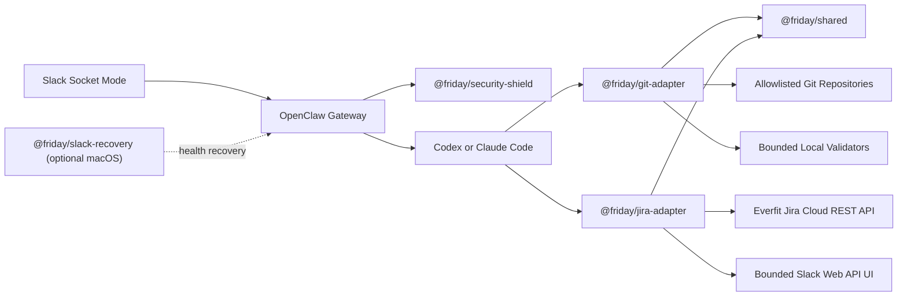
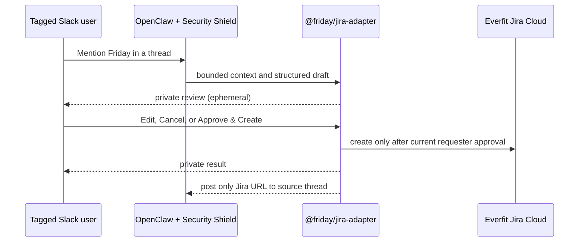

# Friday Architecture

Friday is an npm monorepo with five independent workspaces. OpenClaw is the
runtime host; Friday supplies plugins, contracts, setup automation, and an
optional recovery layer.

## Runtime Flow

Security Shield validates the Slack principal on every run before model or tool
work. Git Adapter exposes only fixed read-only review operations. Jira Adapter
exposes only draft-context and draft-preparation tools; issue creation is a
deterministic requester-approved callback, never a model tool. Both consume
Shared contracts. The plugins do not call each other directly; OpenClaw owns the
lifecycle and policy.

## Workspace Map

| Workspace | Responsibility | May depend on |
| --- | --- | --- |
| `@friday/shared` | Host-neutral schemas, types, and tool-result contracts | No Friday package |
| `@friday/security-shield` | Authorization, persona shielding, and security audit | OpenClaw SDK, Node.js |
| `@friday/git-adapter` | Bounded PR fetch, Terraform/GitOps review, and cache | `@friday/shared`, OpenClaw SDK, Node.js |
| `@friday/jira-adapter` | Everfit Jira metadata, requester-only draft review, and approved issue creation | `@friday/shared`, OpenClaw SDK, Node.js |
| `@friday/slack-recovery` | Optional macOS launchd watchdog | Node.js |

External SDK declarations live in `types/`; they are not domain contracts.
Runtime configuration belongs in `config/`, generated files in `build/`, compiled
artifacts in package `dist/` directories, and version-pinned compatibility
patches in `compat/`. The compatibility layer never stores vendor bundles.

## Dependency Rules

1. `core/shared` must not depend on an integration or runtime host.
2. Packages use workspace names such as `@friday/shared`, never cross-workspace
   relative imports.
3. Integrations expose schema-bound allowlisted operations, not generic shell,
   filesystem, or HTTP primitives to the model. Jira's two model-visible tools
   are `friday_jira_get_context` and `friday_jira_prepare_ticket`; neither can
   create an issue.
4. Setup scripts coordinate packages but do not contain business logic.
5. Secrets, state, databases, logs, and generated artifacts are not source.

`npm run audit:architecture` checks workspace registration, package scope,
internal dependency versions, and cross-workspace relative imports. `npm test`
runs portability and architecture audits, typechecks, tests, and builds.

## Entrypoints

- `core/security-shield/index.ts`: OpenClaw security plugin
- `integrations/git-adapter/index.ts`: OpenClaw review tools plugin
- `integrations/jira-adapter/index.ts`: OpenClaw Jira draft tools and Slack
  interactive-handler registration
- `integrations/slack-recovery/friday-slack-watchdog.ts`: macOS watchdog CLI
- `scripts/full-setup.mjs`: native setup orchestration
- `scripts/container-bootstrap.mjs`: container setup orchestration
- `scripts/slack-compat.mjs`: guarded Slack compatibility patcher
- `container/entrypoint.sh`: container runtime entrypoint

The source diagram is [friday-current.mmd](architecture/friday-current.mmd).

## Jira Ticket Workflow (Everfit Devops)

Phase 1 is one explicit destination: the **Everfit Devops** Jira project,
project key `ED`. Configuration binds its stable project ID, the stable IDs for
`Task`, `Bug`, and `Story`, the `Medium` priority ID, and Tri Pham's Jira
`accountId`. The Jira account email and API token are resolved only through
`emailEnv` and `apiTokenEnv`; `storyPointFieldId` binds the configured numeric
Story point custom field. The adapter creates no Epic and never accepts a
project, assignee, type, priority, or Story-point-field identity supplied by
Slack or the model.

The tagged user alone can view a review, open its modal, edit, cancel, approve,
or retry its link delivery. The draft binds the Slack account, workspace,
channel, thread, requester, and version. The public thread is untouched until
creation succeeds, when it receives only the Jira URL.

An explicit description accompanying the mention is the primary instruction.
The root and replies at or before that mention timestamp supplement it; when
there is no explicit description, that bounded thread snapshot is summarized.
Later replies cannot alter a pending draft. Ticket text is English and contains
only relevant text. Links and attachments may appear as references, but files,
images, icons, reactions, jokes, chat, and decorative emoji are excluded.
Missing facts are visibly marked rather than invented.

The proposal is classified as `Bug` for faulty behavior or incidents, `Story`
for user/product value, and `Task` for technical, operational, research, or
maintenance work; uncertainty starts as `Task`. It starts at `Medium` and the
requester can edit title, type, description, priority, numeric Story point
estimate, and Epic. The adapter looks only at a bounded active-ED Epic set. It
preselects an existing Epic only for a high-confidence match; otherwise the
selection is `No Epic`.

The durable SQLite state is `friday-jira.sqlite` under OpenClaw's resolved state
directory. It stores structured drafts and idempotency/recovery state, not raw
Slack transcripts. Duplicate clicks, delivery replays, restarts, and safe
retries reconcile the correlation label before another Jira create. An ambiguous
create is never blindly resubmitted.

## Current and Future Shape

Today, one Jira Adapter runtime is deliberately bound to the Everfit Devops
`ED` project and one configured Slack account. The root instance configuration
can hold multiple Slack accounts, but it does not make the current Jira Adapter
multi-project or multi-workspace at runtime. A future multi-workspace design
would require an explicit mapping from each Slack account/workspace to a
separately validated Jira destination and secret reference, then a migration of
the fail-closed configuration and tests. Do not imply that adding a second
`slack.accounts[]` record routes its ticket requests to another Jira site today.
