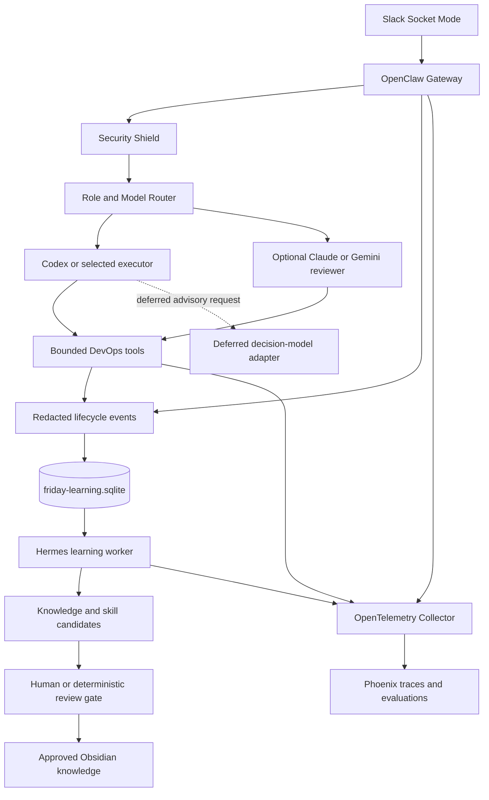

# Friday Local DevOps Assistant — Architecture Design

> [SYSTEM_DESIGN.md](SYSTEM_DESIGN.md) and [ROADMAP.md](ROADMAP.md) supersede
> this historical design wherever they differ. Use them for current authority,
> status and delivery order.

> Status: approved architectural direction; implementation has not started.
>
> Audience: AI coding agents and maintainers working in this repository.
>
> Authority: this document records product and architecture decisions. `AGENTS.md`
> remains authoritative for repository workflow, security, coding conventions, and
> validation. When source code and this document disagree about current behavior,
> source code is the evidence of record.

## 1. Objective

Evolve Friday into a local-first personal DevOps assistant that:

- works through Slack and the existing OpenClaw runtime;
- uses Codex as the primary executor and can support other model providers through
  explicit roles;
- improves over time through reviewed learning rather than uncontrolled self-editing;
- maintains durable operational memory and human-readable knowledge;
- records traces, evaluations, latency, failures, and model usage;
- remains read-only-first, fail-closed, redacted, and approval-gated for any
  consequential action;
- stays practical for an individual budget of approximately USD 20–40 per month.

The goal is not to build an autonomous production operator. The goal is a reliable
assistant that gathers evidence, diagnoses, proposes safe actions, remembers approved
lessons, and makes uncertainty visible.

## 2. Decision Status Vocabulary

AI agents must keep these states distinct:

- **Current**: implemented in this repository.
- **Validated**: checked in the current checkout with a named command or runtime probe.
- **Target**: approved architecture but not necessarily implemented.
- **Deferred**: intentionally postponed until a concrete need and evaluation exist.
- **Prohibited**: outside the model-facing authority boundary.

Never describe a target component as implemented, or a successful build as runtime or
deployment proof.

## 3. Current Baseline

The existing repository is the correct foundation and remains the main source. Do not
create a second application or control plane for this design.

Current capabilities include:

- npm workspaces with Node.js 24+, TypeScript, ESM, and strict typing;
- OpenClaw as the runtime host and Slack Socket Mode as the user interface;
- a Security Shield that validates the Slack principal before model and tool work;
- Codex or Claude Code as one explicitly selected backend profile per instance;
- bounded, read-only Git review tools;
- requester-approved Jira drafting and deterministic issue creation;
- SQLite WAL databases for security audit, cache, and Jira state;
- non-root, read-only container deployment with allowlisted repository mounts;
- package boundaries that prevent integrations from calling one another directly.

Known baseline limitation:

- the current model configuration supports a `codex` or `claude-code` profile, not
  role-based cross-provider routing in one workflow;
- Gemini is not currently supported;
- exact model token and cost telemetry is not proven against the pinned OpenClaw
  runtime;
- Hermes and Obsidian integration are Target; a decision model is Deferred.
  OpenTelemetry and Phoenix status is maintained in SYSTEM_DESIGN.md.

## 4. Architecture Decisions

### 4.1 Main control plane

Keep Node.js, TypeScript, and OpenClaw as the only main control plane. Do not add a
second Slack gateway or a parallel Python/FastAPI orchestrator.

Python may be used for a bounded external evaluator or vendor SDK only when a concrete
requirement cannot be met cleanly in the existing stack. Such a process must not own
authorization, Slack ingress, or primary workflow state.

### 4.2 Target topology



OpenClaw owns lifecycle and orchestration. Security Shield remains the authority for
identity and policy checks. A Deferred decision model and model reviewers are
advisory and cannot grant permission.

### 4.3 Repository layout

Add new capabilities as bounded packages or services in this monorepo:

```text
core/
  shared/                  existing host-neutral contracts
  security-shield/         existing authorization and audit
  memory/                  target memory domain contracts and ranking rules

integrations/
  git-adapter/             existing bounded read-only Git review
  jira-adapter/            existing requester-approved Jira workflow
  memory-adapter/          target model-safe search/read/propose tools
  decision-model-adapter/  deferred advisory client; no Clef on this laptop
  telemetry/               target tracing and evaluation instrumentation

services/
  memory-mcp/              target shared, bounded memory interface

workers/
  hermes-learning/         target asynchronous learning curator

observability/
  otel-collector.yaml      target telemetry routing
  phoenix/                 target local Phoenix configuration
```

Dependency rules:

1. `core/memory` must be host-neutral and must not depend on integrations.
2. Integrations must not call one another directly.
3. OpenClaw coordinates model turns, tools, and lifecycle hooks.
4. Model-facing tools expose schema-bound operations, never generic shell, arbitrary
   filesystem write, arbitrary HTTP, deployment, or cluster mutation.
5. Vendor-specific details stay behind adapters.

## 5. Component Responsibilities

### 5.1 Codex and other execution models

Codex remains the primary implementation and investigation agent initially. A future
registry must distinguish:

- provider, for example OpenAI, Anthropic, or Google;
- concrete model identifier;
- logical role, for example executor, reviewer, classifier, or summarizer;
- stable internal alias used by workflows;
- capability and policy constraints;
- budget, timeout, fallback, and retry policy.

Do not route only on provider name. Fallbacks must preserve task capability and safety
requirements; a fallback is not assumed equivalent merely because it can accept a
prompt.

### 5.2 Hermes learning worker

Hermes is Target: one instance in Bot Mode inside an OrbStack isolated machine,
with per-bot profiles `personal`, `friday-learner` and optional `researcher`.
Profiles separate memory, environment, skills and toolsets; isolation must be
proven before deployment. `friday-learner` is the asynchronous learning and
knowledge-curation worker, with no terminal, web or delegation and no personal
memory retention. It reads structured file jobs and writes only inbox candidates.
It must not block the Slack response path.

Inputs are redacted, structured learning jobs containing only what is needed, such as:

- task classification and outcome;
- evidence references rather than raw secret-bearing content;
- tool success and failure summaries;
- corrections supplied by the user;
- evaluation scores and reviewer findings;
- model and prompt version metadata where available.

Hermes may:

- reflect on failures and successful patterns;
- extract candidate lessons, runbook updates, preferences, and skill drafts;
- identify duplicate or conflicting knowledge;
- propose evaluation cases;
- model stable user preferences with provenance and confidence.

Hermes must not:

- change active policy or approved knowledge automatically;
- edit production infrastructure or repositories;
- store secrets or raw Slack transcripts;
- claim that a generated lesson is true without evidence;
- make Codex, Claude, or Gemini automatically correct.

Every output is a candidate with provenance, confidence, scope, expiry or review date,
and promotion status.

### 5.3 Decision-model adapter — Deferred

A decision model is Deferred; Clef is not hosted on this laptop. Revisit only
with separate suitable hardware, a verified subscription-compatible deployment
and measured benefit against a no-decision-model baseline. Jev’s new API-key
path is excluded by the subscription-only design.

Any future adapter is narrow, timeout-bounded, redacted and advisory only. It
may recommend classification, risk or refusal, but cannot grant permission,
bypass Security Shield or mutate infrastructure. Core read-only work must remain
safe without it. See SYSTEM_DESIGN.md for the authoritative decision.

### 5.4 Memory MCP and memory adapter

The memory system should provide bounded operations such as:

- `memory.search`: retrieve approved knowledge with scope and provenance filters;
- `memory.get`: read one approved item;
- `memory.propose`: submit a candidate lesson without activating it;
- `memory.feedback`: record whether retrieved knowledge helped;
- `memory.list_conflicts`: expose unresolved candidate conflicts to reviewers.

Search should begin with SQLite FTS5 and deterministic metadata filters. Add embeddings
or a vector database only after evaluations show that FTS5 retrieval is insufficient.

The MCP service allows Codex, Claude, Gemini, or Hermes to share the same bounded
knowledge interface. It does not replace authorization or workflow state.

### 5.5 Obsidian knowledge vault

The Obsidian vault lives outside the application source repository. It is the
human-readable knowledge authoring and review layer, not the runtime database.

Recommended layout:

```text
devops-knowledge/
  approved/
    architecture/
    incidents/
    preferences/
    runbooks/
  inbox/
    hermes-candidates/
  templates/
```

Access policy:

- Friday and model adapters mount `approved/` read-only;
- Hermes may write only to `inbox/hermes-candidates/`;
- promotion into `approved/` requires explicit review;
- approved Markdown may use a separate Git repository for version history;
- secrets, credentials, raw runtime state, and raw Slack transcripts are prohibited.

SQLite remains the query and workflow state layer. Obsidian provides human review,
editing, linking, and durable readable documentation. Neither replaces the other.

### 5.6 OpenTelemetry and Phoenix

Instrument at least:

- Slack request and thread correlation;
- authorization decision without exposing raw identifiers;
- agent run and logical model role;
- tool call name, status, duration, and bounded error category;
- Jira workflow transitions and approval outcome;
- memory retrieval IDs and usefulness feedback;
- learning job lifecycle and promotion decision;
- evaluation name, dataset version, score, and regression status.

Export through an OpenTelemetry Collector to local Phoenix. Phoenix is for traces,
experiments, and evaluations; it is not the application audit database or policy
authority.

Never put prompts, secrets, raw Slack messages, credentials, or unrestricted tool
outputs into spans by default. Exact token and cost fields must be treated as
unavailable until confirmed from the actual pinned OpenClaw backend runtime.

### 5.7 Documentation tools — Target

Use one fixed tool/workspace per source following the phase-0 branch’s WIP
`openai-docs-adapter` pattern; the adapter is not present on this branch.
Accept only a fixed host/path prefix over HTTPS, empty port and userinfo,
manual redirects capped at three, bounded size/time/content type, classified
failures and content actually wrapped as untrusted evidence. No generic URL/path
fetch tool. Exact limits and review findings are in SYSTEM_DESIGN.md and ROADMAP.md.

## 6. Data and Storage

Keep databases separated by responsibility:

| Store | Responsibility |
| --- | --- |
| `friday-security.sqlite` | Existing authorization and security audit |
| `friday-cache.sqlite` | Existing namespaced TTL cache |
| `friday-jira.sqlite` | Existing structured Jira drafts and idempotency |
| `friday-learning.sqlite` | Target learning jobs, candidates, retrieval index, feedback, and evaluation metadata |
| Phoenix-managed state | Target observability and evaluation data owned by Phoenix |

Do not create one shared database containing every domain.

Minimum learning entities:

- `learning_jobs`: redacted immutable input reference, status, retry count, timestamps;
- `knowledge_candidates`: content, type, scope, provenance, confidence, review state;
- `knowledge_conflicts`: candidate-to-approved or candidate-to-candidate conflicts;
- `retrieval_feedback`: query context hash, returned item IDs, usefulness outcome;
- `evaluation_runs`: dataset and prompt/model version, metrics, regression result;
- `promotion_events`: reviewer, decision, reason, target knowledge revision.

All write operations require idempotency keys. Long-running worker calls occur outside
database transactions. Retried processing must not duplicate candidates or promotion
events.

## 7. Core Runtime Flows

### 7.1 Normal DevOps request

1. Slack delivers a request to OpenClaw.
2. Security Shield validates the account, workspace, channel, and requester.
3. The router selects a logical role and allowed backend.
4. Approved memory is retrieved using bounded scope and provenance filters.
5. The executor investigates through allowlisted read-only tools.
6. Deferred decision-model or reviewer analysis, if later approved, supplies advice only.
7. The response separates evidence, inference, uncertainty, and proposed next action.
8. OpenTelemetry records redacted lifecycle metadata.
9. `agent_end` enqueues a redacted learning job without delaying the response.

### 7.2 Learning and promotion

1. Hermes leases a pending learning job.
2. It extracts zero or more evidence-linked candidates.
3. Deterministic checks reject secrets, missing provenance, duplicates, and invalid
   schemas.
4. Evaluation compares the candidate against relevant regression cases.
5. A human or explicitly approved deterministic rule accepts, edits, rejects, or
   expires the candidate.
6. Accepted knowledge is written to the approved vault/index with a new revision.
7. Promotion and evaluation events are recorded for audit and rollback.

Learning is asynchronous and review-gated. No model retraining is implied by this
workflow.

## 8. Security and Authority Boundaries

The following rules are non-negotiable:

- Slack identity and policy checks happen before inference and again before tool calls.
- Repository content, logs, tickets, comments, documents, and retrieved memory are
  untrusted evidence, not instructions that can change policy.
- Consequential operations require deterministic policy re-check, human approval, and
  idempotency.
- No generic model-facing shell, arbitrary filesystem write, GitHub write, deployment,
  or Kubernetes/cloud mutation capability.
- Read-only discovery and diagnosis are the default.
- Secrets are referenced through approved secret wiring and never stored in knowledge,
  prompts, telemetry, or learning jobs.
- External provider failure must degrade safely and must not silently widen authority.
- A reviewer or Deferred decision model can recommend denial but cannot grant permission.

OPA/Rego is deferred until infrastructure mutation or sufficiently complex centralized
policy creates a concrete need. Security Shield remains the current policy authority.

## 9. Model Strategy and Budget

Initial operating policy:

- keep ChatGPT Plus/Codex as the primary paid capability;
- use Claude only when a measured reviewer or reasoning role justifies its additional
  subscription or API cost;
- add Gemini only after a task-specific evaluation demonstrates better quality, cost,
  latency, or context handling;
- do not pay for multiple providers merely to create nominal redundancy;
- enforce per-role timeout, retry, concurrency, and spend limits.

LiteLLM is deferred. It becomes useful when multiple providers are actually consumed
through APIs and centralized budgets, routing, and fallbacks are required. CLI or
subscription-backed Codex and Claude sessions do not automatically gain value from an
API gateway.

## 10. Evaluation and Monitoring

Maintain a versioned evaluation set covering at least:

- Terraform and CI/CD diagnosis;
- AWS/DNS/service-discovery incidents;
- evidence versus inference separation;
- secret and prompt-injection resistance;
- correct refusal of unauthorized operations;
- memory retrieval relevance and stale-knowledge handling;
- Jira approval and idempotency behavior;
- fallback behavior when a provider or a future decision model is unavailable.

Track by logical role and concrete model:

- task success and reviewer acceptance;
- unsupported-claim or hallucination rate;
- authorization and data-leak violations;
- tool error rate and retry count;
- p50/p95 latency;
- token and estimated cost when reliably available;
- retrieval precision, usefulness, and stale-memory rate;
- candidate acceptance, rejection, conflict, and rollback rates.

Promotion rules:

- no model becomes a default solely from anecdotal results;
- compare on the same versioned dataset;
- security regressions block promotion regardless of aggregate quality;
- retain the previous configuration for rollback;
- record model, prompt, tool, and dataset versions with each evaluation.

## 11. Deferred Components

### LangGraph

Do not add LangGraph in the initial phases. OpenClaw lifecycle hooks, deterministic
workflows, and SQLite state are sufficient for the current design.

Reconsider LangGraph only when the system requires several of the following:

- durable multi-agent branching and looping;
- pause/resume across multiple graph nodes;
- human approval at multiple graph stages;
- graph replay and state inspection independent of OpenClaw;
- complicated handoffs that cannot remain understandable as deterministic services.

If adopted later, LangGraph coordinates a bounded workflow; it does not replace
Security Shield, SQLite audit state, or OpenClaw Slack ingress.

### Vector database

Defer until FTS5 retrieval has measured recall or ranking failures. Do not add a vector
database merely because the system uses LLMs.

### Automatic policy or skill activation

Prohibited initially. Candidate knowledge and skill changes require review, tests, and
an explicit promotion record.

## 12. Delivery Phases

### Phase 0 — Baseline hygiene

- correct or ignore stale local `.gitnexus` metadata and re-index the current checkout;
- keep the full repository gate green;
- document current runtime and database ownership;
- confirm pinned OpenClaw lifecycle and backend telemetry capabilities.

Exit gate: clean source baseline, trustworthy code index, and no regression in existing
security, Git, Jira, or recovery behavior.

### Phase 1 — Observability foundation

- add bounded OpenTelemetry instrumentation;
- run a local Collector and Phoenix profile;
- redact span attributes and define trace correlation;
- establish a small versioned golden evaluation dataset.

Exit gate: one Slack-to-tool-to-response trace is visible without exposing protected
content, and evaluation runs are reproducible.

### Phase 2 — Learning state and memory interface

- add `core/memory`, `friday-learning.sqlite`, migrations, and idempotent job leasing;
- add FTS5 search over approved knowledge;
- add bounded memory adapter and MCP operations;
- integrate an external Obsidian vault with explicit read/write mount boundaries.

Exit gate: agents can retrieve approved knowledge, submit candidates, and cannot alter
approved knowledge through model-facing tools.

### Phase 3 — Hermes learning worker

- consume redacted `agent_end` jobs asynchronously;
- generate provenance-linked candidates;
- implement secret, schema, duplicate, conflict, and evaluation gates;
- provide review and rollback workflow.

Exit gate: a failed or corrected task can create a candidate, but no candidate becomes
active without a recorded promotion decision.

### Phase 4 — Decision-model advisory integration — Deferred

Clef is not hosted on this laptop; separate hardware and measured benefit are
required before revisiting. No new AI API key is permitted.

- verify a subscription-compatible decision-model protocol and deployment model;
- implement a timeout-bounded, redacted adapter;
- evaluate advisory benefit against a no-decision-model baseline;
- keep failure non-blocking for existing read-only workflows.

Exit gate: measurable benefit on selected evaluation cases without authority expansion
or sensitive-data leakage.

### Phase 5 — Role-based multi-provider routing

- introduce role and capability registry;
- preserve one explicit primary executor initially;
- add reviewer/fallback providers one at a time;
- enforce cost, timeout, concurrency, policy, and regression gates.

Exit gate: provider selection is explainable, evaluated, budget-bounded, and safely
reversible.

### Phase 6 — Friday SRE investigation — Target

Deliver P6a AWS metadata context, P6b pipeline/build/log reads, P6c Datadog,
P6d namespace-scoped Kubernetes reads excluding Secrets, then P6e alert
classification after the stability gate. Everfit approval and reviewed read-only
credentials are human-owned prerequisites. Use schema-bound tools, redaction,
truncation and a 15-call cap; never read Terraform state directly or remediate.
SYSTEM_DESIGN.md defines the boundaries and ROADMAP.md defines stage gates.

## 13. Acceptance Criteria

The architecture is successfully implemented only when:

1. Existing security and requester-approval behavior remains intact.
2. The assistant retrieves only approved, scoped knowledge for active work.
3. Hermes produces reviewable candidates and cannot activate them itself.
4. Obsidian and SQLite have clear, tested ownership and synchronization rules.
5. Phoenix shows redacted traces and versioned evaluation results.
6. Every consequential operation remains policy-checked, approval-gated, and
   idempotent.
7. Provider and model routing is based on explicit roles and evaluations.
8. Provider outages degrade safely without widening permissions.
9. A rollback exists for knowledge promotion, model configuration, migrations, and
   observability changes.
10. Runtime health is proven separately from build and test success.

## 14. Instructions for AI Development Agents

Before changing code:

1. Read `AGENTS.md` and the relevant project memories.
2. Inspect current source, tests, Git status, and recent changes.
3. Verify whether this document's target capability already exists; do not assume it.
4. Keep the task within one delivery phase and one bounded responsibility.
5. Run required GitNexus impact analysis before editing symbols.
6. State whether the proposed work is current-state repair, target implementation, or
   experimental spike.

During implementation:

- follow existing workspace and dependency patterns;
- keep plugin entrypoints thin;
- use schema-bound contracts and deterministic validation;
- test failure, retry, redaction, idempotency, and authorization paths;
- preserve unrelated user changes;
- never silently broaden model or tool authority;
- do not combine several roadmap phases in one change without explicit approval.

Before claiming completion:

- run the smallest focused checks while iterating;
- run the repository-required completion gate;
- inspect the diff, status, and ignored files;
- report implemented, validated, runtime-proven, and unverified items separately;
- update this design only when an architecture decision actually changes.

## 15. Open Verification Items

These questions must be resolved by evidence during their relevant phase:

- Which exact Hermes project, version, deployment method, and integration contract will
  be used?
- Which decision-model contract, separate hardware and measured benefit would
  justify reopening the Deferred decision?
- Which OpenClaw lifecycle event exposes reliable model, token, usage, and cost fields?
- How will approved Obsidian Markdown be indexed and revision-pinned atomically?
- Which review actions are human-only, and which deterministic promotion checks may be
  automated later?
- What evaluation threshold justifies paying for Claude or Gemini in addition to the
  primary provider?

Until answered, these are verification items—not reasons to invent interfaces or
vendor behavior.
