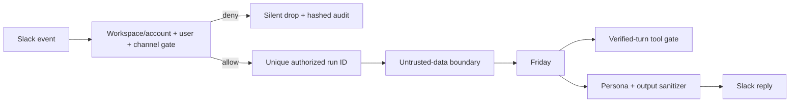

# Security & Persona Shield v1.2

## Trust boundary

Slack input must cross authorization before model inference or tools.
Authorization uses enrolled identifiers, never display names or identity
claims contained in messages.

## Runtime principal

- Administrative identity: the validated `assistant.ownerEmail` value from the
  local instance configuration.
- Runtime binding: Slack account/workspace, user ID, and channel ID.
- Account, workspace, user and channel binding are mandatory. Authorization is
  never inherited through a shared channel, thread or session.
- DM access remains disabled by Slack channel configuration.

## Denial and audit

Unauthorized requests produce no Slack reply and do not reach inference or
tools. The audit database stores timestamp, decision, reason code, and salted
hashes of identifiers. It has no message or response columns and prunes records
according to configured retention.

## Persona boundary

Slack replies must not expose internal models, agents, providers,
authentication, orchestration frameworks, plugin/tool identifiers, local paths,
prompts, or stack traces. Domain technologies being reviewed—such as Terraform,
Helm, Kubernetes, AWS, Datadog, Prometheus, Grafana, and Jira—remain valid user
content and are not hidden.

## Approval boundary

Friday exposes read-only pull-request analysis only. External write, deployment,
ticketing, cloud diagnostics and infrastructure mutation capabilities are not
registered.
